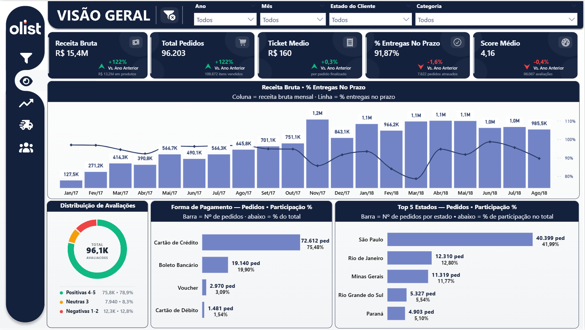
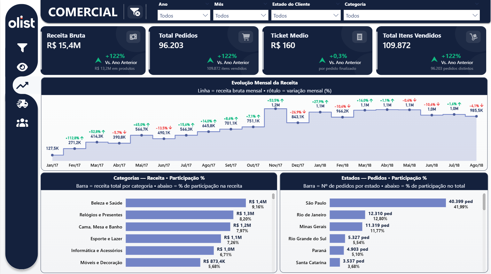
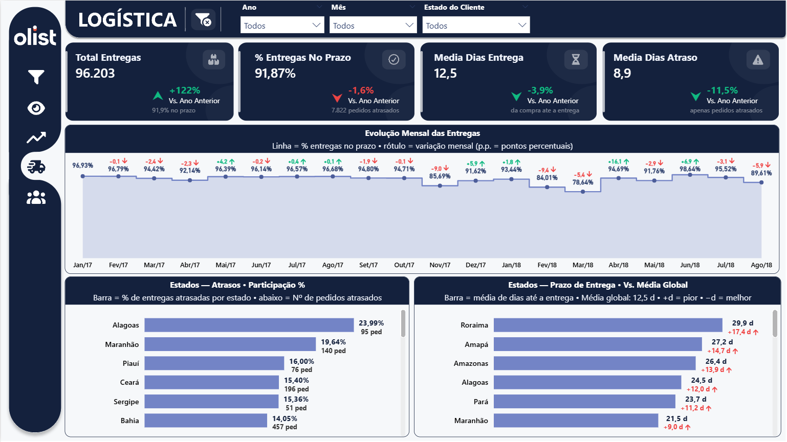
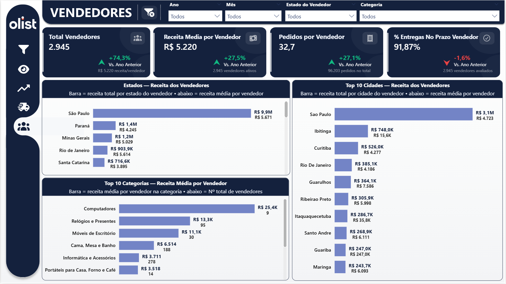

<div align="center">

# 🛒 Olist E-Commerce — Analytics Dashboard

**Power BI · SQL Server · DAX · Power Query**

[](https://linkedin.com/in/victor-ozores/)
[](https://app.xperiun.com/in/victor-ozores)
[](https://github.com/victor-ozores)

</div>

---

## Resumo

Dashboard de análise do marketplace Olist, maior plataforma de e-commerce brasileiro, construído sobre o dataset público do Kaggle com 100 mil pedidos de 2017 a 2018.

O objetivo era ir além da análise exploratória padrão e construir um produto analítico completo — com uma camada SQL intermediária que organiza os dados antes de chegarem ao Power BI, cards de KPI customizados em SVG gerados por DAX, e comparativos YOY que se suprimem automaticamente quando o período anterior é insuficiente para comparação.

O resultado são quatro páginas que permitem entender a operação de ponta a ponta: receita por categoria e estado, SLA logístico por região, performance por vendedor, e satisfação dos clientes correlacionada com pontualidade de entrega.

---

## O Que Ele Responde

- Quais categorias e estados concentram a maior parte da receita?
- A operação logística melhorou ou piorou ao longo dos meses?
- Quais estados têm a maior taxa de atraso e o maior tempo médio de entrega?
- Pedidos atrasados recebem avaliações piores do que pedidos no prazo?
- Quais vendedores têm a maior receita média por pedido, e em quais cidades estão concentrados?
- Como a receita e o volume de pedidos variaram mês a mês?

---

## Páginas do Dashboard

| Página | O que entrega |
|--------|---------------|
| **Visão Geral** | KPIs consolidados: receita, pedidos, ticket médio, % entregas no prazo, score médio — com variação YOY e distribuição de avaliações |
| **Comercial** | Evolução mensal da receita com variação MoM, ranking de categorias e participação por estado |
| **Logística** | SLA mensal em p.p., ranking de estados por taxa de atraso e tempo médio de entrega vs. média global |
| **Vendedores** | Receita total e média por estado e cidade, top categorias por receita média por vendedor |

---

## 🔗 Ver Dashboard Online

[](https://app.powerbi.com/view?r=eyJrIjoiOTU5ZmQ0ZjgtMDk1NC00Yjc1LWIwOWItMTg2ZDRlNDcyMzBlIiwidCI6IjY1OWNlMmI4LTA3MTQtNDE5OC04YzM4LWRjOWI2MGFhYmI1NyJ9&pageName=b5340fed4ab16024cace)

---

## 📸 Preview

### Visão Geral


### Comercial


### Logística


### Vendedores


---

<details>
<summary>⚙️ Detalhes Técnicos</summary>

<br>

### Arquitetura

```
Kaggle Dataset (8 CSVs)
  └── SQL Server — banco OLIST
        ├── fn_LimpaCidade         ← normaliza seller_city (typos, padrões compostos)
        ├── fn_TitleCase           ← title case para customer_city
        ├── vw_dim_estado          ← 27 estados com nome completo e região
        ├── vw_dim_forma_pagamento ← formas de pagamento com labels em português
        ├── vw_dim_vendedor        ← dimensão de vendedores com cidade e estado
        ├── dim_categoria          ← 74 categorias com mapeamento snake_case → português
        ├── vw_comercial           ← pedido × item: receita, categoria, cliente, pagamento
        ├── vw_logistica           ← pedido: frete total, prazos, status de entrega
        ├── vw_vendedores          ← pedido × item × vendedor: receita e pontualidade
        └── vw_avaliacoes          ← avaliações com score, latência e indicadores binários
              │
              ▼ Power Query (Import Mode)
              │
              ▼ Star Schema
        ├── Fact_Comercial
        ├── Fact_Logistica
        ├── Fact_Vendedores
        ├── Fact_Avaliacoes
        ├── Dim_Calendario (tabela DAX, 26 colunas)
        ├── Dim_Estado
        ├── Dim_Forma_Pagamento
        ├── Dim_Categoria
        └── Dim_Vendedor
              │
              ▼ ~90 medidas DAX · 7 UDFs
              │
              ▼ Report (4 páginas)
```

---

### Camada SQL — Por Que Existe

As tabelas-fonte do Kaggle chegam brutas, sem qualquer tratamento. A camada SQL resolve quatro problemas antes dos dados chegarem ao Power BI:

**Filtros de qualidade obrigatórios** — das 99 mil ordens no banco, apenas pedidos com `status = 'delivered'` e data de entrega real preenchida entram no modelo. 2016 é excluído por ter apenas 267 pedidos delivered em 3 meses não consecutivos, sem valor analítico e distorcendo comparativos YOY.

**Lógica de negócio encapsulada** — a `vw_comercial` usa CTEs internas para selecionar a forma de pagamento de maior valor em pedidos com múltiplos métodos (2.961 casos no banco). A `vw_logistica` usa window functions para somar o frete total de todos os itens enquanto colapsa para uma linha por pedido, e elege o vendedor principal por critério de maior frete individual.

**Separação de responsabilidades** — SQL faz ETL e regras de negócio; Power Query faz transporte; DAX faz cálculo dinâmico. Quando uma regra muda, altera-se a view, não o `.pbix`.

**Grain explícito por tabela de fato** — cada view tem um grain diferente e não intercambiável: `vw_comercial` e `vw_vendedores` são pedido × item (109.872 linhas), `vw_logistica` é pedido (96.203 linhas), `vw_avaliacoes` é avaliação (96.087 linhas).

---

### Modelagem — Decisões Relevantes

**4 facts separadas em vez de uma única** — grains diferentes exigem tabelas diferentes. Misturar pedido × item com pedido geraria dupla contagem em qualquer métrica de entrega. Com facts separadas, `COUNTROWS` e `SUM` operam direto no grain correto.

**`Dim_Estado` com relacionamento inativo em `Fact_Logistica`** — o modelo tem dois campos de estado em logística (cliente e vendedor). O relacionamento ativo usa `Estado Cliente`; as medidas de logística por estado ativam o relacionamento explicitamente via `USERELATIONSHIP`, dando controle preciso sobre qual coluna está sendo filtrada em cada visual.

**`TREATAS` para cruzar avaliações com logística** — `Fact_Avaliacoes` e `Fact_Logistica` compartilham `pedido_id` mas não têm relacionamento no modelo (facts não se relacionam entre si em star schema). `Score Médio No Prazo` e `Score Médio Atrasados` usam `TREATAS` para criar uma relação virtual em tempo de query, sem poluir o modelo com relacionamentos entre fatos.

**`Dim_Calendario` em DAX** — tabela calculada via `CALENDAR() + ADDCOLUMNS` com 26 colunas de contexto temporal. Marcada como Date Table, com Auto date/time desabilitado.

**`dim_categoria` como tabela física** — a translation table do Kaggle traduz para inglês, não português. As 74 categorias com labels em PT-BR foram mapeadas manualmente e armazenadas como tabela física com `PRIMARY KEY` e `UNIQUE KEY`. As views de fato joinam por `categoria_raw` (snake_case da fonte).

---

### DAX — Medidas e UDFs

**~90 medidas** organizadas em display folders por domínio:

| Pasta | Conteúdo |
|-------|----------|
| `Comercial\Calculos` | Receita, pedidos, ticket médio, itens vendidos, MoM, participação por categoria e estado |
| `Logistica\Calculos` | Total entregas, % no prazo, média de dias, atrasos por estado com `USERELATIONSHIP` |
| `Vendedores\Calculos` | Total vendedores, receita média, pedidos por vendedor |
| `Avaliacoes\Calculos` | Score médio, Score No Prazo e Score Atrasados via `TREATAS` |
| `*/Eixo` | Teto e piso dinâmicos de eixo Y via `fxEixoMax` / `fxEixoMin` |
| `*/Imagens` | Cards KPI, donut de distribuição de score — todos em SVG via DAX |
| `Config\Cores` | 12 medidas `Cfg *` com HEX — paleta global propagada para todos os SVGs |

**7 User Defined Functions (DAX Preview):**

| UDF | O que faz |
|-----|-----------|
| `fxFormatoMoeda(Valor)` | Escala automática por magnitude: `R$ 0` / `R$ 8.722` / `R$ 27,0K` / `R$ 1,2M` |
| `fxFormatoRotulo(Valor)` | Igual, sem prefixo `R$` — para rótulos de gráficos de linha |
| `fxEixoMax(Valor, Buffer)` | Teto do eixo Y arredondado com buffer percentual |
| `fxEixoMin(Valor, Buffer)` | Piso do eixo Y para valores negativos |
| `fxSvgMontarCard(...)` | Gera SVG de card KPI com ícone, seta animada e subtexto contextual |
| `fxSvgMontarDonut(...)` | Gera SVG de donut com até 5 segmentos e legenda animada |
| `fxSvgMontarGauge(...)` | Gera SVG de gauge semicircular com animação de crescimento |

Os cards de KPI são implementados com SVG gerado dinamicamente pelo DAX e exibido via `dataCategory = ImageUrl`. Isso permite seta animada com CSS, subtexto contextual calculado em DAX, e supressão automática de comparação YOY quando o período anterior tem menos meses que o atual (`BaseInsuf`).

---

### Padrões Aplicados

- ✅ Nomenclatura SQLBI: `Fact_`, `Dim_`, `_Medidas`
- ✅ Formatação DAX via daxformatter.com — `VAR/RETURN` em todas as medidas não triviais
- ✅ `DIVIDE()` onde denominador pode ser zero — nunca `+ 0` desnecessário
- ✅ `FILTER(ALL())` em vez de `FILTER(table)` quando boolean resolve
- ✅ Date Table marcada · Auto date/time desabilitado
- ✅ Relacionamentos single direction como padrão — bidirecional apenas com justificativa
- ✅ Chaves de relacionamento como string curta — sem GUID como chave
- ✅ `TREATAS` para relacionamentos virtuais entre facts — sem relacionamentos diretos entre fatos

</details>

---

<div align="center">

Feito por **Victor Ozores** · [linkedin.com/in/victor-ozores](https://linkedin.com/in/victor-ozores/) · [app.xperiun.com/in/victor-ozores](https://app.xperiun.com/in/victor-ozores)

</div>